```mermaid
flowchart TB
    subgraph External ["🌐 Ingress & Edge Networking"]
        WAN["Public Traffic (Internet)"]
        CF["Cloudflare Zero Trust Tunnel"]
        TS["Tailscale VPN (Private Admin Mesh)"]
        CADDY["Caddy Reverse Proxy
(Automated TLS / zstd / @scanners drop / :8443 SSL)"]
    end

    subgraph Security ["🔐 Secrets & Reliability"]
        VW["Vaultwarden (Bitwarden Server)
(Password Vault & SubtleCrypto :8443)"]
        UK["Uptime Kuma
(Service & Port Latency Monitor)"]
        HC["Healthchecks.io
(1-min Heartbeat Outage Ping)"]
        MAINT["Maintenance Reporter
(Weekly APT & Docker CVE Telegram Audits)"]
    end

    subgraph Core ["🏠 Home Automation & Administration"]
        HA["Home Assistant Core
(Hardware Telemetry & Lovelace UI)"]
        PORTAL["Tailscale Portal (Nginx)
(Direct Access Index :8088)"]
        TERM["Web Terminal (ttyd)
(Secure Host CLI Access)"]
        FB["FileBrowser
(Storage & Workspace Management)"]
        GA["GoAccess
(Real-Time WebSocket Web Analytics)"]
    end

    subgraph Energy ["⚡ Solar & Energy Ecosystem"]
        SE_BOT["SolarEdge Bot (Node.js 20)
(24h Live Dashboard, Tiered Alerts & Auto-Cleanup)"]
        SE_UI["SolarEdge Dashboard (React/Vite)
(Real-Time Energy & Weather Flow)"]
        SE_INV["SolarEdge Inverter API"]
        TG["📱 Telegram Channel & Topics
(Live Status, Weather, Maintenance)"]
    end

    subgraph Meteo ["🌤️ Meteorological Telemetry Stack (TempsCat)"]
        DAVIS["Davis Vantage Pro2 Console
(Serial /dev/ttyS0 & /dev/ttyS1)"]
        CMX["Cumulus MX Engine
(Real-Time Sensor Parser & Catalan AI2 UI)"]
        TMPFS["RAM tmpfs Mount (64MB)
(Absorbs 30s writes / 20-Year SSD Longevity)"]
        W34["Weather34 / CuHWS Portal (PHP 8.2)
(tempscat.com / Davis Ticker / Unified Charts / SEO)"]
        MC["Meteoclimatic Feeder Daemon
(Dual Night Safeguard & Watchdog Timer)"]
    end

    subgraph IoT ["📡 Message Broker & Sensors"]
        MQTT["Mosquitto MQTT Broker"]
        RAPL["Intel RAPL Hardware Power Daemon"]
        SMART["SATA & NVMe SMART Health Monitor"]
        ROUTERS["Dual Router Mesh Health Bridge
(ASUS ROG & Vera Optical ONT)"]
    end

    subgraph Storage ["💾 Storage & Cold Backups"]
        SATA["SATA Cold Backup SSD
(/mnt/backups)"]
        BKP["Automated Daily Backup Script
(04:00 AM Cron / 14-day Rolling Retention)"]
    end

    WAN --> CADDY
    CADDY -->|tempscat.com / meteosallent.com 301| W34
    CADDY --> GA
    CADDY -->|HTTPS :8443| VW
    CF --> CADDY
    TS --> HA
    TS --> PORTAL
    TS --> TERM
    TS --> FB
    TS --> UK

    SE_INV --> SE_BOT
    SE_INV --> SE_UI
    SE_BOT --> MQTT
    SE_BOT -.->|Live Dashboard & Rollover| TG

    DAVIS --> CMX
    CMX --> TMPFS
    TMPFS --> W34
    CMX --> MQTT
    CMX --> MC

    MQTT --> HA
    MQTT --> SE_BOT
    RAPL --> HA
    SMART --> HA
    ROUTERS --> HA

    HC -.->|Heartbeat| WAN
    MAINT -.->|Audit Reports| TG
    BKP --> SATA
```

# ⚡ Homelab & IoT Infrastructure

[](https://www.docker.com/)
[](https://www.home-assistant.io/)
[](https://caddyserver.com/)
[](https://cloudflare.com/)
[](https://tailscale.com/)
[](https://github.com/dani-garcia/vaultwarden)
[](https://github.com/louislam/uptime-kuma)
[](https://vitejs.dev/)
[](https://mosquitto.org/)
[](LICENSE)

An enterprise-grade, energy-optimized personal homelab architecture running on Linux. Features containerized IoT pipelines, edge reverse proxying with multi-domain automated TLS and bot shielding, high-precision weather station telemetry (Davis Vantage Pro2 Plus), photovoltaic solar monitoring with a 24-hour live Telegram dashboard and auto-cleanup alerts, hardware power sensors (Intel RAPL), RAM tmpfs write buffering for 20+ year SSD endurance, encrypted password management (Vaultwarden), proactive service monitoring (Uptime Kuma & Healthchecks.io), automated weekly security/update auditing via Telegram, and unified administration dashboards.

---

## 🏛️ Architecture Overview

The system is orchestrated via Docker Compose in an isolated bridge network (`homelab-net`, `172.20.0.0/16`), with strict boundary separation between public web services, private administrative endpoints, IoT broker pipes, and automated maintenance watchdogs.

<p align="center">
  <a href="docs/architecture.svg" target="_blank">
    
  </a>
  <br>
  <em>🔍 <b>Tip:</b> Click on the image to open the full-size diagram in scalable vector format (SVG).</em>
</p>

<details>
<summary><b>📐 View Mermaid diagram source code</b></summary>



</details>

---

## 📦 Container Stack & Microservices

The stack consists of 14 containerized microservices managed via Docker Compose:

| Service | Technology | Port(s) / Binding | Description & Purpose |
| :--- | :--- | :--- | :--- |
| **`caddy`** | Caddy v2 (Alpine) | `80`, `443`, `7880`, `8443` | Edge reverse proxy with automated Let's Encrypt certificates for `tempscat.com`, 301 canonical redirects from `meteosallent.com`, `zstd`/`gzip` compression, active bot scanner drops (`abort @scanners`), legacy VWS URL rewrites, and internal SSL termination for Vaultwarden on `:8443`. |
| **`homeassistant`** | Home Assistant Core | `host:8123` | Unified smart home and infrastructure command center with custom YAML views, Intel RAPL power meters, SMART disk telemetry, router bridges, and embedded service panels. Runs in `network_mode: host` for mDNS and Tuya discovery. |
| **`weather34`** | PHP 8.2 Apache | `8090` | High-frequency responsive meteorological portal ([tempscat.com](https://www.tempscat.com)) powered by customized CuHWS. Features a Davis Vantage Pro2 console marquee ticker, dynamic comfort humidity droplet, unified solar/UV/watts charts, METAR ceiling sync, and Pla Alfa risk indicators. |
| **`cumulusmx`** | Cumulus MX .NET Core | `8998` | Weather station engine with hardware serial access (`/dev/ttyS0`, `/dev/ttyS1`). Interfaces with the Davis Vantage Pro2 console, serves the localized Catalan AI2 dashboard, streams MQTT topics (`clima/#`), and synchronizes 20-year NOAA historical archives. |
| **`solaredge-bot`** | Node.js 20 | Internal | Autonomous energy assistant managing a **24-hour live dynamic status dashboard** in Telegram, tiered production/consumption alerts with automatic self-cleanup, 21:00 rollover daily summaries, and night quiet hours. Bridges solar metrics to Mosquitto. |
| **`solaredge-dashboard`**| React 18 + Vite | `5173` | Interactive photovoltaic flow dashboard displaying real-time power generation, household consumption, grid balance, and live weather overlays. |
| **`mosquitto`** | Eclipse Mosquitto | `1883` | Central MQTT 5.0 message broker connecting Cumulus MX weather telemetry, SolarEdge energy metrics, and Home Assistant sensors. |
| **`vaultwarden`** | Rust / Vaultwarden | `8080` (SSL `:8443`) | Lightweight Bitwarden-compatible password vault with WebSocket push synchronization, proxied securely through Caddy with local TLS to enable browser `SubtleCrypto` APIs. |
| **`uptime-kuma`** | Node.js / Uptime Kuma | `3001` | Proactive monitoring and incident alert platform tracking local container health, internal ports, external domains, and latency SLAs. |
| **`tailscale-portal`** | Nginx Alpine | `100.122.161.66:8088` | Dedicated private landing portal bound strictly to Tailscale VPN, providing instant 1-click access to all homelab web apps without browser iframe restrictions. |
| **`goaccess`** | GoAccess C Daemon | `7890` (Web `:7880`) | Real-time web log visualizer parsing Caddy access logs and streaming live WebSocket analytics to private administrative dashboards. |
| **`filebrowser`** | Go FileBrowser | `8085` | Multi-user web file manager providing remote filesystem exploration, configuration editing, and snapshot management across `/opt/servidor`, `/mnt/backups`, and host storage. |
| **`web-terminal`** | ttyd / Alpine Linux | `7681` | Web-based terminal emulator integrated into Home Assistant's sidebar for authenticated CLI administration from any browser. |
| **`cloudflared`** | Cloudflare Tunnel | Outbound | Zero Trust outbound tunnel profile facilitating public edge ingress without opening incoming router ports. |

---

## 🔋 Hardware, Power & Storage Optimization

The host is an ultra-compact mini-PC configured for 24/7 continuous operation under strict thermal and longevity criteria:

- **BIOS TDP Limit:** Package power capped at **19W** (Package Power Limit 1 & 2), ensuring quiet acoustic levels and near-ambient thermals (~40–45°C) without CPU throttling.
- **NVMe Power Management:** Autonomous Power State Transitions (APST) enabled with latency thresholds set to enter Non-Operational Low Power States (**PS1/PS2**) during idle cycles.
- **Intel RAPL Real-Time Telemetry:** Custom Python monitor polling kernel `intel-rapl` interfaces directly, providing granular CPU Package, Cores, and Uncore wattage metrics to Home Assistant.
- **RAM tmpfs Buffer (20+ Year SSD Endurance):** High-frequency weather telemetry files (`realtime.txt`, `websitedataT.json`, `clientraw.txt`) update every 30 seconds. To prevent premature NAND flash wear on the host NVMe SSD, the output directory (`/opt/servidor/cumulusmx/web`) is mounted as an in-memory **64MB tmpfs RAM disk**, initialized automatically on system boot via `cumulus-web-init.service`.
- **Storage Tiering:** Fast NVMe storage dedicated to OS, container runtimes, and databases; dedicated local SATA SSD storage (`/mnt/backups`) for cold snapshots and disaster recovery archives.

---

## 🛡️ Security, Privacy & Bot Mitigation

- **Strict Zero-Secrets Policy:** All sensitive credentials, API keys, tokens, and coordinates are abstracted into `.env` configuration files ignored by Git (`.gitignore`).
- **Server Information Concealment:** Reverse proxies and web servers strip `Server`, `Via`, and `X-Powered-By` response headers to prevent software version fingerprinting.
- **Active Scanner Defense:** Caddy immediately terminates connections (`abort @scanners`) targeting common vulnerability paths (`.git`, `.env`, WordPress, PHPMyAdmin, AWS credentials), saving system resources and preventing log pollution.
- **Administrative Network Isolation:** Internal management dashboards (Home Assistant, FileBrowser, Web Terminal, Vaultwarden, Uptime Kuma) are restricted strictly to private LAN and encrypted Tailscale VPN mesh connections.
- **Tailscale Portal Access Control:** The dedicated portal (`tailscale-portal`) enforces strict Nginx ACLs permitting traffic solely from Tailscale IP ranges (`100.64.0.0/10` and `fd7a:115c:a1e0::/48`), Docker subnets, and localhost.
- **Internal HTTPS for SubtleCrypto:** Modern password vault clients require a secure context (`HTTPS` or `localhost`) for crypto operations. Caddy provides local TLS termination on port `8443` with pre-generated certificates for seamless LAN/Tailscale Vaultwarden usage.
- **Protected Configuration Endpoints:** Caddy and Apache configurations enforce 403 Forbidden responses (`@blocked`) on administrative setup scripts (`easyweathersetup.php`, `settings.php`).

---

## 🌤️ Meteorological Platform (TempsCat & MeteoSallent)

The station stack processes real-time telemetry from a **Davis Vantage Pro2 Plus** weather station:

- **Multi-Domain Routing & 301 Canonicalization:** Caddy manages automated Let's Encrypt certificates for `tempscat.com` and `www.tempscat.com`. All traffic to legacy `meteosallent.com` and `www.meteosallent.com` is automatically 301-redirected to `https://www.tempscat.com`.
- **Legacy URL Rewriting:** Historical links from older Virtual Weather Station (VWS) pages (`/sallent/dades/vws/*`) and Sant Quirze feeds (`/santquirze/*`) are permanently redirected to their modern counterparts.
- **Davis Vantage Pro2 Console Marquee Ticker:** Custom-engineered top marquee banner simulating the physical Davis console ticker with smooth continuous scrolling, dynamic condition-based Easter eggs (heat index, wind chill, precipitation milestones, astronomical events), and compact responsive design.
- **Custom-Calibrated KPI Modules:**
  - Dynamic humidity droplet with subtle drop shadow and comfort thresholds (`#E6EE9C`).
  - Reorganized barometer and temperature maximum/minimum mini-blocks for enhanced hierarchy.
  - Side-by-side wind speed, maximum gust, and hourly trend modules with exact timestamps.
  - Unified Solar Radiation (W/m²), UV Index, and Solar Energy combined chart.
  - Interconnected temperature and dew point / humidity chart navigation.
  - Dynamic 8-phase lunar cycle disc displaying real-time ephemerides.
- **External Feeds & Regional Sync:**
  - Local caching of official DWD (Deutscher Wetterdienst) and Met Office synoptic surface pressure charts.
  - Integrated Pla Alfa forest fire risk telemetry and METAR cloud ceiling synchronization.
  - 20-year NOAA historical climate records (2006–2026) accessible via `historia.php`.
  - Autonomous Meteoclimatic DATA2 feed (`meteoclimatic_updater.py`) featuring dual-stage night solar clamping, in-memory caching, and automated watchdog monitoring.
- **Full SEO & Web Performance Suite:** Localized multilingual metadata (Catalan, Spanish, English, French), Schema.org JSON-LD structured location data (`Place` / `GeoCoordinates`), automated language negotiation favoring Catalan for search engine crawlers, `robots.txt`, `sitemap.xml`, and modern `zstd`/`gzip` compression.

---

## 🤖 Automated Operations, Backups & Health Observability

The homelab runs automated daemons and scheduled cron tasks to guarantee 24/7 high availability and data resilience:

- **Automated Nightly Backups (`homelab-backup`):**
  Executed every morning at **04:00 AM** via `/mnt/backups/scripts/backup_daily.sh` (or `/opt/servidor/backup.sh`). Creates atomic snapshots of:
  - Home Assistant configurations (`/opt/servidor/homeassistant/config`)
  - Cumulus MX persistent records (`/opt/servidor/cumulusmx/data`)
  - Mosquitto MQTT persistence state (`/opt/servidor/mosquitto/data`)
  - Vaultwarden encrypted database (`/opt/servidor/vaultwarden/data`)
  - Uptime Kuma monitoring state (`/opt/servidor/uptime-kuma/data`)
  - Secured `.env` file (permissions `600`)
  - Automatic rolling retention pruning snapshots older than 14 days on cold SATA storage.

- **Weekly Maintenance & CVE Telegram Audits (`homelab-manteniment`):**
  Triggered every **Saturday at 10:00 AM** via `/opt/servidor/scripts/informe_manteniment.sh`. The script:
  - Updates APT package lists and analyzes pending Debian upgrades.
  - Detects security-critical CVE updates and reports if a system reboot is required (`/var/run/reboot-required`).
  - Inspects all running Docker containers and compares local digests against remote registries via `buildx imagetools` to identify available image updates without downloading unnecessary layers.
  - Dispatches an executive HTML summary directly to the dedicated Telegram maintenance topic (`TELEGRAM_UPDATES_TOPIC_ID`).

- **Dual Heartbeat & Outage Detection (`homelab-heartbeat`):**
  - Sends a ping every 60 seconds to **Healthchecks.io**. If the internet connection drops or the server loses power, Healthchecks.io dispatches an immediate external alert.
  - Internal service health continuously polled by **Uptime Kuma** (`:3001`).

- **Meteoclimatic Watchdog Timer (`meteoclimatic-watchdog.timer`):**
  Systemd timer checking `meteoclimatic.htm` freshness every 10 minutes. If the feed becomes stale or corrupt, the watchdog automatically regenerates the payload and restarts `meteoclimatic-updater.service`.

---

## 🚀 Getting Started

### Prerequisites
- Linux host running Docker Engine 24+ and Docker Compose v2.
- Serial port device connection (Davis console via `/dev/ttyS0` or `/dev/ttyS1`) or mock telemetry.
- Dedicated cold storage mount point at `/mnt/backups`.

### Deployment

1. **Clone the repository:**
   ```bash
   git clone git@github.com:r0grr/homelab.git /opt/servidor
   cd /opt/servidor
   ```

2. **Configure Environment Variables:**
   ```bash
   cp .env.example .env
   # Edit .env and supply your local IPs, API keys, and notification tokens
   nano .env
   ```

3. **Initialize RAM tmpfs for Cumulus MX (Optional but Recommended):**
   ```bash
   # Add tmpfs mount to /etc/fstab:
   # tmpfs /opt/servidor/cumulusmx/web tmpfs defaults,noatime,nosuid,nodev,noexec,mode=0777,size=64M 0 0
   sudo mount -a
   sudo systemctl enable --now cumulus-web-init.service
   ```

4. **Deploy the Docker Stack:**
   ```bash
   docker compose up -d
   ```

5. **Verify Container Health:**
   ```bash
   docker compose ps
   ```

6. **Verify Automated Cron Tasks:**
   ```bash
   ls -la /etc/cron.d/homelab-*
   ```

---

## 📄 License

This project is open-source and licensed under the terms of the [MIT License](LICENSE).
