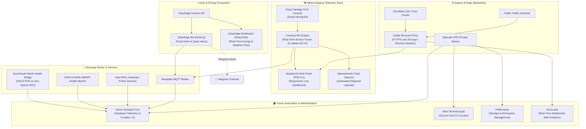

# ⚡ Homelab & IoT Infrastructure

[](https://www.docker.com/)
[](https://www.home-assistant.io/)
[](https://caddyserver.com/)
[](https://cloudflare.com/)
[](https://vitejs.dev/)
[](https://mosquitto.org/)
[](LICENSE)

An enterprise-grade, energy-optimized personal homelab architecture running on Linux. Features containerized IoT pipelines, edge security reverse proxies, high-precision weather station telemetry, solar photovoltaic monitoring with Telegram alerting, hardware power sensors, and unified Home Assistant administration dashboards.

---

## 🏛️ Architecture Overview

The system is orchestrated via Docker Compose in an isolated bridge network (`homelab-net`), with strict boundary separation between public web services, private administrative endpoints, and IoT broker pipes.



---

## 📦 Container Stack & Microservices

| Service | Technology | Port(s) | Description & Purpose |
| :--- | :--- | :--- | :--- |
| **`caddy`** | Caddy v2 (Alpine) | `80`, `443`, `7880` | Edge reverse proxy with automated TLS, security headers removal, and access logs. |
| **`homeassistant`** | Home Assistant Core | `host:8123` | Unified smart home & infrastructure monitoring with customized YAML views. |
| **`weather34`** | PHP 8.2 Apache | `8090` | High-frequency responsive meteorological portal customized for station telemetry. |
| **`cumulusmx`** | Cumulus MX .NET Core | `8998` | Weather station engine with localized responsive AI2 interface and MQTT bridges. |
| **`solaredge-dashboard`**| React 18 + Vite | `5173` | Photovoltaic flow dashboard with live solar radiation & UV metrics. |
| **`solaredge-bot`** | Node.js 20 | Internal | Smart Telegram assistant with automated generation/consumption rules & night quiet hours. |
| **`mosquitto`** | Eclipse Mosquitto | `1883` | Low-latency message broker connecting Cumulus MX, solar metrics, and Home Assistant. |
| **`goaccess`** | GoAccess C Daemon | `7890` | Real-time web log visualizer streaming WebSocket telemetry to private dashboards. |
| **`filebrowser`** | Go FileBrowser | `8085` | Multi-user web file manager for workspace configurations and backup volumes. |
| **`web-terminal`** | ttyd / Alpine Linux | `7681` | Web-based terminal emulator integrated seamlessly into Home Assistant's sidebar. |
| **`cloudflared`** | Cloudflare Tunnel | Outbound | Secure Zero Trust application tunnel eliminating open router ports for public access. |

---

## 🔋 Hardware & Power Optimization

The host is an ultra-compact mini-PC configured for 24/7 continuous operation with aggressive energy efficiency constraints:

- **BIOS TDP Limit:** Package power capped at **19W** (Package Power Limit 1 & 2), ensuring quiet operation and near-ambient thermals without performance throttling.
- **NVMe Power Management:** Autonomous Power State Transitions (APST) active with latency thresholds set to enter Non-Operational Low Power States (**PS1/PS2**) during idle cycles.
- **Intel RAPL Real-Time Telemetry:** Custom Python monitor (`read_power.py`) polling kernel `intel-rapl` interfaces directly to break down wattage across CPU Package, Cores, and Uncore components in Home Assistant.

---

## 🛡️ Security & Privacy Engineering

- **Strict Zero-Secrets Policy:** All sensitive tokens, API keys, credentials, and coordinates are abstracted into `.env` configuration files ignored by version control.
- **Server Information Concealment:** Caddy and Apache configurations strip `Server`, `Via`, and `X-Powered-By` headers to prevent OS and software version fingerprinting.
- **Access Route Hardening:** Cloudflare Ingress and Caddy matchers enforce 403 Forbidden responses on administrative setup scripts and sensitive configuration paths.
- **Edge Zero Trust Isolation:** Internal administrative services (Home Assistant, FileBrowser, Web Terminal, router management interfaces) are restricted strictly to private LAN and Tailscale mesh connections.

---

## 🚀 Getting Started

### Prerequisites
- Linux host running Docker Engine 24+ and Docker Compose v2.
- Serial port device connection (for Davis weather station) or mock telemetry pipeline.

### Deployment

1. **Clone the repository:**
   ```bash
   git clone git@github.com:r0grr/homelab.git
   cd homelab
   ```

2. **Configure Environment Variables:**
   ```bash
   cp .env.example .env
   # Edit .env and supply your local IPs, API keys, and notification tokens
   nano .env
   ```

3. **Deploy the Docker Stack:**
   ```bash
   docker compose up -d
   ```

4. **Verify Container Health:**
   ```bash
   docker compose ps
   ```

---

## 📄 License

This project is open-source and licensed under the terms of the [MIT License](LICENSE).
